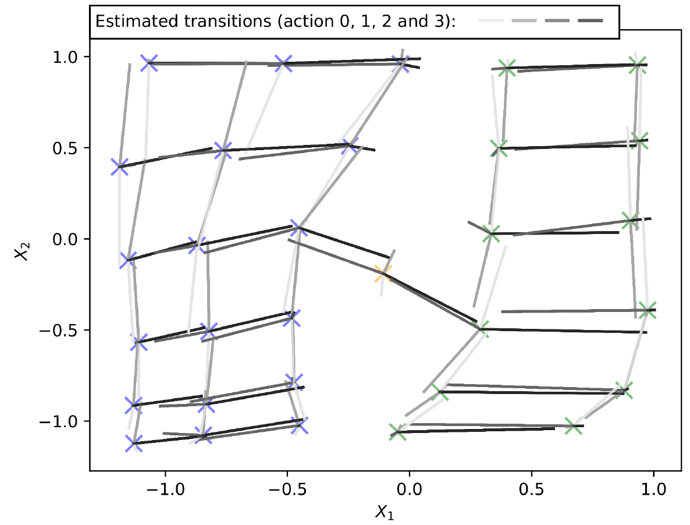
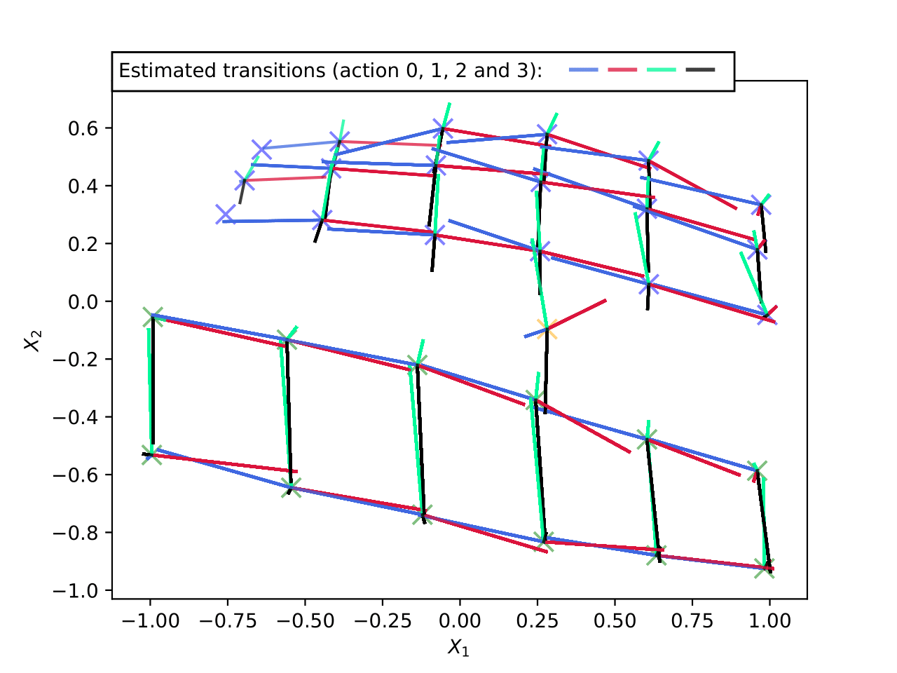
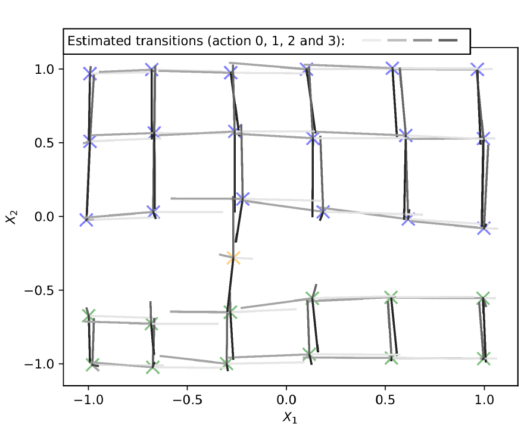
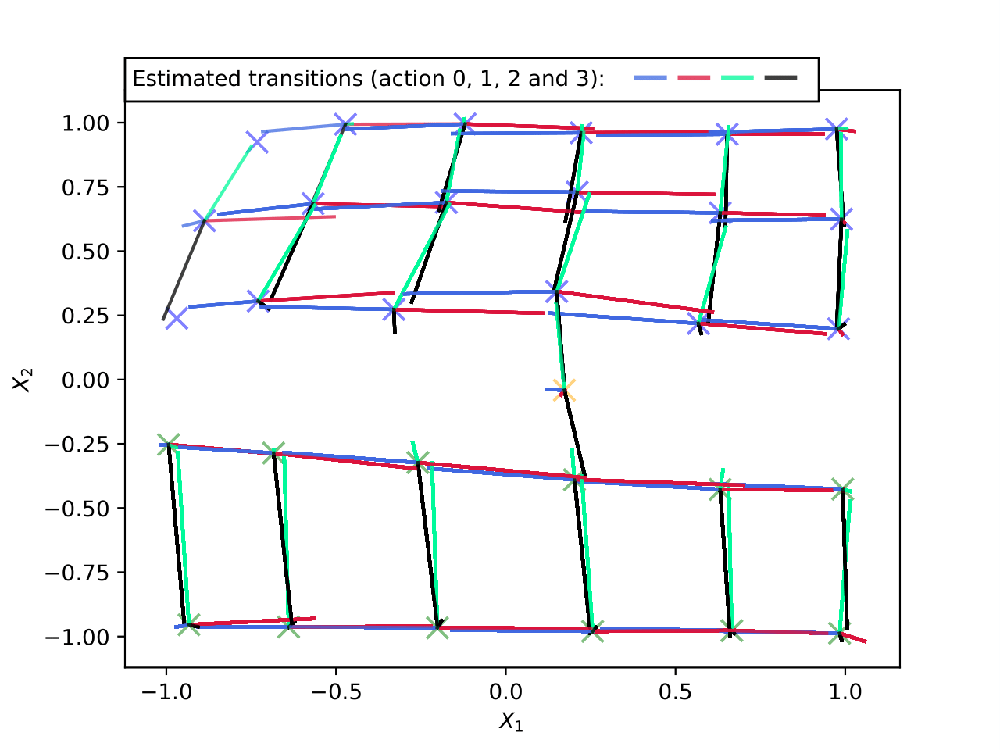

# CRAR-PyTorch

I replicate the work from Combined Reinforcement Learning via Abstract Representations (CRAR) [\[François-Lavet, Vincent, et al, 2019\]](https://arxiv.org/abs/1809.04506).

## Installation and Setup

I recommend setting up a [conda environment](https://docs.conda.io/projects/conda/en/latest/user-guide/tasks/manage-environments.html) for running this project. The code should work for all Python 3.6+. Then install CUDA Toolkit (the version depends on you GPU) on your machine, either using `conda`, your package manager, or from [Nvidia's website](https://developer.nvidia.com/cuda-toolkit). Next, install PyTorch (>= 1.4.0), PyTorch Lightning (>=0.7.5), and NumPy (>=1.18) using `pip install -r requirements.txt` or manually using your package manager or `conda`.

Finally, run `python setup.py install` while at the root of this repository.

## Reproducing Labyrinth plot

To reproduce the labyrinth abstract representation plots, change the `plot_dir` under `SimpleMaze-v0` in `config.yaml` to a desired path. Then run `python trainer.py --env SimpleMaze-v0`. Following are my results for the labyrinth plot.

For the agent without the interpration loss, the original result:

And my result:

>  Note that there is nothing enforcing what the orientation of the encoding should be. Consequently, it’s possible to end up with different orientations of the labyrinth on different runs of the algorithm (even different figures in the original paper have different orientations).

For the agent with the interpretation loss, the original result:

And my result:

> The alignment vector I chose was  and the one in the original paper was . Thus, my representation is a mirror image of the one from the original paper.
